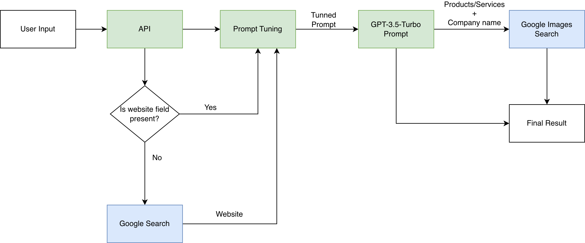

# Innoscripta Challenge:
This is the solution for the Innoscripta Challenge.

## The Challenge:
The goal of this hackathon is to get detail information about what a company produces/offers/sells. The solution should be country & language independent where the output should be in English.

The challenge here is basically build a search engine that will retrieve informations about a seached company.

The user will pass an input with the following informations:
1. Company Name*
2. Country*
3. Website URL

The output must be:
1. Products / services
2. Keywords (additional points)
3. Product / service images (additional points)
4. Company branch (additional points)
5. Other informations about their business activity (additional points)

## The Solution:

## Running the Solution:
This solution is mainly based in two different APIs: OpenAI API and SerpAPI. So the user must create two access keys for them.

### Creating OpenAI API Access Key:
To create an OpenAI API Access Token please refer to: https://platform.openai.com/account/api-keys

### Creating SerpAPI API Access Key:
To create an SerpAPI API Access Token please refer to: https://serpapi.com/account-api

### Seting up the project:
1. This repo must be cloned;
2. The user must copy .env-fillme to a new file named .env;
3. The user must fill OPENAI_API_KEY with OpenAI API key in the newly copied .env file;
4. The user must fill SERPAPI_KEY with SerpAPI key in the newly copied .env file;

### Build Dockerfile and Run Docker container:
The solution can be replicated using a Docker container:

```
docker build -t innoscripta .

docker run -p 8885:8885 innoscripta
```
Once this is done the API will be running and ready to go.

To manual test it one can go to: 127.0.0.1:8885/docs and test GET company manually.

### Test Script:
Once the docker container is up and running, one can test the API via script too:

```
pyhon api_test_script.py
```